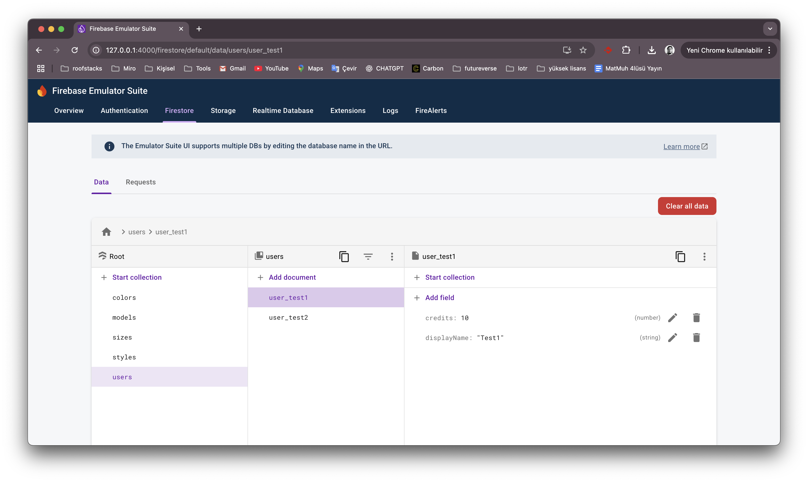
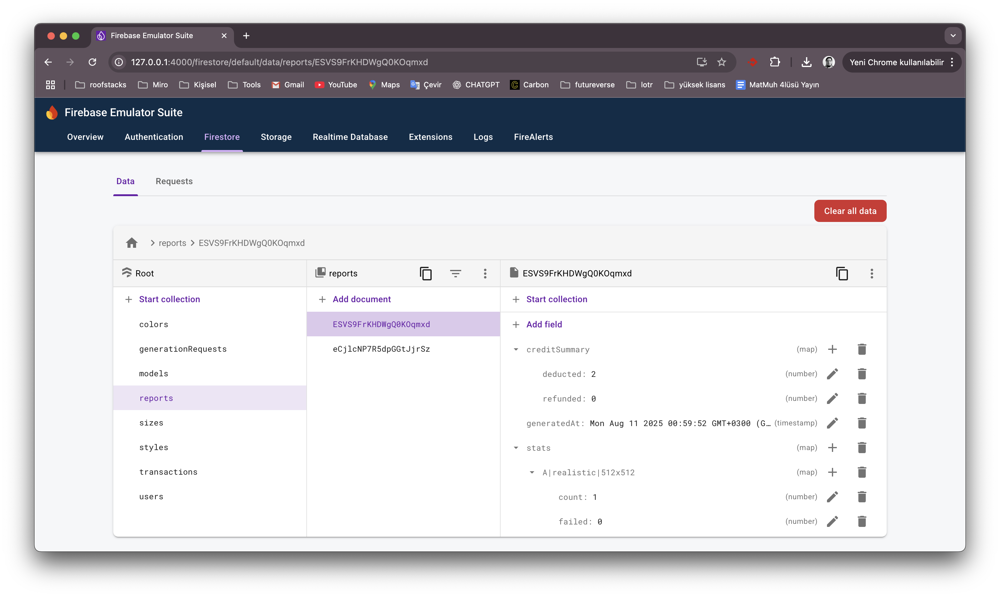

# AI Image Generation Backend System

## Overview
A backend system for AI image generation requests, credit deduction/refund, and reporting, using Firestore (with emulator support).

## Project Structure
- `src/` - Flask app, Firestore logic, background worker
- `scripts/seed_firestore.py` - Seeds Firestore emulator with test data
- `tests/` - Pytest unit/integration tests
- `firebase.json` - Emulator config
- `.github/workflows/ci.yml` - Example CI for GitHub Actions
- `images/` - Example screenshots for setup and usage
- `api.http` - Ready-to-use HTTP requests for manual API testing

## Setup & Local Development
1. **Install dependencies:**
   ```sh
   pip install -r requirements.txt
   ```
2. **Start Firestore emulator:**
   ```sh
   firebase emulators:start --only firestore
   ```
3. **Seed the database:**
   ```sh
   python scripts/seed_firestore.py
   ```
4. **Start the backend (Flask):**
   ```sh
   FIRESTORE_EMULATOR_HOST=localhost:8080 python src/app.py
   ```
5. **Run tests:**
   ```sh
   pytest
   ```

## Endpoints
### 1. Create Generation Request
- **POST /createGenerationRequest**
- **Input JSON:**
  ```json
  {"userId": "user_test1", "model": "A", "style": "realistic", "color": "vibrant", "size": "512x512", "prompt": "A cat in space"}
  ```
- **Response:**
  ```json
  {"generationRequestId": "...", "deductedCredits": 1, "currentCredits": 9}
  ```
- **Example:**
  ```sh
  curl -X POST http://localhost:5000/createGenerationRequest \
    -H "Content-Type: application/json" \
    -d '{"userId":"user_test1","model":"A","style":"realistic","color":"vibrant","size":"512x512","prompt":"A cat in space"}'
  ```

### 2. Get User Credits
- **GET /getUserCredits?userId=user_test1**
- **Response:**
  ```json
  {"currentCredits": 9, "transactions": [ {"id": "...", "type": "deduction", "credits": 1, "generationRequestId": "...", "timestamp": "..."} ]}
  ```
- **Example:**
  ```sh
  curl "http://localhost:5000/getUserCredits?userId=user_test1"
  ```

### 3. Schedule Weekly Report
- **POST /scheduleWeeklyReport**
- **Response:**
  ```json
  {"reportStatus": "success"}
  ```
- **Example:**
  ```sh
  curl -X POST http://localhost:5000/scheduleWeeklyReport
  ```

## Quick cURL Tests

### 1. Create Generation Request
```sh
curl -X POST http://localhost:5000/createGenerationRequest \
  -H "Content-Type: application/json" \
  -d '{"userId":"user_test1","model":"A","style":"realistic","color":"vibrant","size":"512x512","prompt":"A cat in space"}'
```

### 2. Get User Credits
```sh
curl "http://localhost:5000/getUserCredits?userId=user_test1"
```

### 3. Schedule Weekly Report
```sh
curl -X POST http://localhost:5000/scheduleWeeklyReport
```

Each command's expected output is shown above in the endpoint section.

## Visual Guide

Below are example screenshots for Firestore emulator usage and seeding:

### Firestore Emulator Startup



### Users After Seeding



## Firestore Emulator Export (Initial Data)

When starting the project for the first time, follow these steps to begin with predefined users and options:

1. Start the Firestore emulator with export:
   ```sh
   firebase emulators:start --import=./emulator-export
   ```
2. Now all test users, colors, styles, and sizes will be automatically loaded.

> Note: The export folder (`emulator-export/`) is included in the repository. You can reset your data by running the seed script and the export command again.

## Notes
- All credit changes are atomic via Firestore transactions.
- The background worker simulates image generation and updates status.
- For production, use Cloud Tasks or Pub/Sub for background jobs.

## CI
See `.github/workflows/ci.yml` for an example GitHub Actions job running tests with a Firestore emulator.

## Further Enhancements & Best Practices
- **Authentication:** Integrate Firebase Auth or another authentication system for secure user management.
- **API Documentation:** Add OpenAPI/Swagger documentation for easier API consumption.
- **Error Handling:** Improve error messages and add logging for better debugging and monitoring.
- **Rate Limiting:** Prevent abuse by limiting the number of requests per user.
- **Admin Panel:** Build a simple admin dashboard to view users, requests, and reports.
- **Production Deployment:** Containerize the app (Docker), use Google Cloud Run or App Engine, and connect to a real Firestore instance.
- **Monitoring:** Integrate with tools like Sentry or Stackdriver for error and performance monitoring.
- **Unit & Integration Tests:** Expand test coverage, especially for edge cases and failure scenarios.
- **CI/CD:** Automate deployment and testing with GitHub Actions or another CI/CD tool.
- **Localization:** Add support for multiple languages in API responses and documentation.

## Anomaly Detection in Weekly Report

The weekly report endpoint can be extended to include basic anomaly detection for usage spikes. For example, if the total number of generations this week is more than twice the average of previous weeks, an "anomaly" field can be included in the report.

Example output:

```json
{
  "reportStatus": "success",
  "anomaly": "Usage spike detected: 120 generations this week (avg: 40)"
}
```

How to implement:
- In the weekly report function, also calculate the total number of generations for previous weeks.
- If this week's generation count exceeds a certain multiple of the previous average, add an anomaly field to your response.

## Test Coverage

The project includes both unit and integration tests. To run the tests:

```sh
pytest
```

The tests cover:
- Credit deduction and refund logic
- Validation of valid and invalid model, style, and color
- Generation request lifecycle (create, update, delete)
- Weekly report endpoint execution

To further increase test coverage, you can add tests for API input validation and edge-case scenarios.
